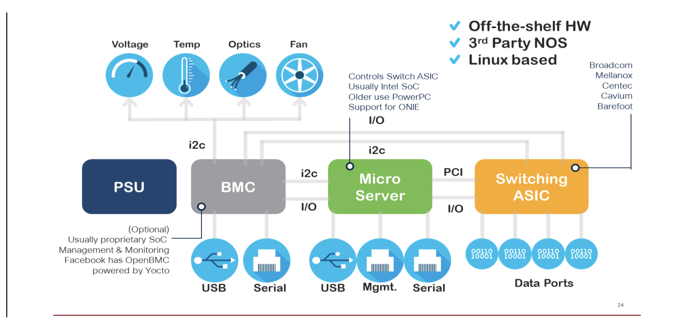

### whitebox

A low cost hardware based switch based on off the shelf components that is capable of running a 3rdparty operating system over a Linux foundation. All white boxes consist of four basic modules:

* Power Supply Unit
* Board Management Controller (manages environmentals)
* Microsever (routing protocols, management, UI)
* Switching ASIC (forwarding functions, Broadcom being the major supplier)

### In order to understand further, lets discuss first, **what is disaggregation?**
* decoupling of network hardware with network operating system
* gives customer a choice to choose network hardware and the NOS that is best suited for their application ennvironment
 

### Does IOS-XR run on third party devices?
Yes, IOS-XR7 runs on severalcertified whiteboxes;the Edgecore AS-5916 and AS-7816. [[Click me](https://xrdocs.io/cloud-scale-networking/blogs/2018-03-08-enabling-ios-xr-on-third-party-network-hardware/)]

### What skills do I need to support whiteboxes?
1. XR software configuration and troubleshooting (LNT XR)
2. Whitebox Architecture -Understanding and working knowledge of router/switch hw architecturesCPU, PSU, ASICs etc
3. Working knowledge of Linux and Linux tools, particularly [ONL](http://opennetlinux.org/)
4. Docker for Docker base installationsof XRon whitebox
5. ONIE -Open Network Install Environment

#### Additional desirable skills
1. Knowledge of the [open compute project](https://www.opencompute.org/)
2. Ansible
3. Python, REST
4. DEVNET, Netconf, Restconf, Yang, NSO

### Cisco Solutions: 
* Intergrated solution (NCS5500, Spitfire) (usual install, upgrades)
* Disaggregated Solution (3rd party HW) (ONIE is used for image discovery and installation)

### ONIE (Network OS Install Environment) [ref](https://www.onie.org/)
* Provides an environment for network OS installater and execution
* like a pre-installed kickstater
* Implemented using a modern linux kernal and busybox

### ONIE - Intro

* When an ONIE-enabled network switch boots for the first time, theboot loader launches the kernel, which starts the **ONIE discovery and execution (ODE)** application
* The ODE uses a number of methods (like local files, DHCP, IPv6neighbors, mDNS/DNS-SD) to locate and download (via HTTP orTFTP) an operating system installer.
* Once the installer is found, the ODE executes the installer, which thenproceeds to provision the machine in an NOS-specific way.

**The initial ONIE GRUB menu looks like this:**

#### The first time the switch boots the following steps happen:
* The boot loader launches the default OS, which is the ONIE kernel.
* The ODE locates an NOS installer.
* The ODE executes the NOS installer
* The NOS installer installs the OS.
* The NOS installer marks the boot environment to boot straight into the NOS
* The system reboots

#### On Subsequent boots:
the system boots straight into the installed NOS, bypassing the ONIE kernel and ODE application. 
The start upsequence for subsequent boots is:
* The boot loader launches the default OS, whichis the NOS
* The NOS boots and executes

In case of IOS-XR Selection from GRUBavailable during boot process

### ONIE CLI: 

ONIE:/ # onie-stop (to stop autodiscovery of image installation)

### Different Components of NOS (Network Operating System)

A base Operating System
A set of hardware monitoring application
A switching Routing Stack
A Hardware Abstraction Layer
A Routing Information Database
A switching information Database
A set of routing switching protocol applications
A set of management applications

++++++++++++++++++
NOTE: Document how to install XR with ONIE through DHCP (and have the 2 entries on the DHCP server for ONIE and XR ZTP) ?
